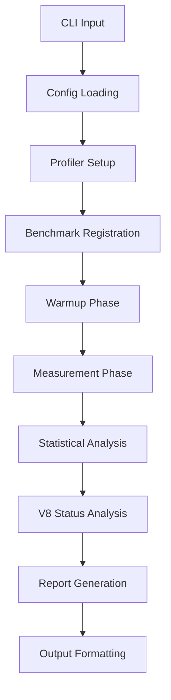

# Design Document

## Overview

This design transforms the V8 deoptimization profiler from a script-based tool into a robust, modular profiling framework while maintaining its functional programming approach. The architecture emphasizes simplicity, reliability, and extensibility without introducing class-based complexity.

## Architecture

### High-Level Structure

```
src/
├── core/
│   ├── profiler.js          // Main profiling orchestration
│   ├── metrics.js           // Statistical analysis functions
│   ├── v8-monitor.js        // V8 intrinsics and monitoring
│   └── benchmarks.js        // Benchmark execution utilities
├── reporters/
│   ├── console.js           // Enhanced console output
│   ├── json.js              // JSON export functionality
│   └── csv.js               // CSV export functionality
├── utils/
│   ├── timer.js             // Enhanced timing utilities
│   ├── config.js            // Configuration management
│   └── async.js             // Async utility functions
├── cli/
│   └── index.js             // Command-line interface
└── examples/
    ├── basic.js             // Simple usage examples
    └── custom-benchmark.js  // Custom benchmark patterns
```

### Data Flow



## Components and Interfaces

### Core Profiler Module

**File: `src/core/profiler.js`**

```javascript
// Main profiling orchestration functions
export async function createProfiler(options = {})
export async function runBenchmarks(profiler, benchmarks)
export async function warmupFunction(fn, runs = 10)
export async function measureFunction(fn, runs = 1000)
```

**Responsibilities:**
- Orchestrate the profiling workflow
- Manage benchmark execution lifecycle
- Coordinate between measurement, analysis, and reporting
- Handle graceful degradation when V8 features unavailable

### Metrics Analysis Module

**File: `src/core/metrics.js`**

```javascript
// Statistical analysis functions
export function calculateStats(measurements)
export function detectOutliers(measurements, threshold = 2)
export function assessReliability(stats)
export function compareResults(baseline, comparison)
```

**Responsibilities:**
- Calculate comprehensive statistical metrics (mean, median, percentiles, std dev)
- Detect and handle outliers appropriately
- Assess measurement reliability and statistical significance
- Provide performance comparison analysis

### V8 Monitoring Module

**File: `src/core/v8-monitor.js`**

```javascript
// V8 intrinsics and optimization monitoring
export function setupV8Monitoring()
export function getOptimizationStatus(fn)
export function decodeOptimizationFlags(status)
export function isV8IntrinsicsAvailable()
```

**Responsibilities:**
- Safely handle V8 intrinsics with fallback behavior
- Monitor stderr for optimization/deoptimization events
- Decode V8 optimization status flags
- Provide graceful degradation when intrinsics unavailable

### Reporter System

**File: `src/reporters/console.js`**

```javascript
// Enhanced console reporting
export function formatConsoleReport(results, options = {})
export function formatPerformanceComparison(results)
export function formatOptimizationStatus(results)
export function formatStatisticalSummary(results)
```

**File: `src/reporters/json.js`**

```javascript
// JSON export functionality
export function formatJsonReport(results, options = {})
export function saveJsonReport(results, filepath)
```

**File: `src/reporters/csv.js`**

```javascript
// CSV export functionality
export function formatCsvReport(results, options = {})
export function saveCsvReport(results, filepath)
```

**Responsibilities:**
- Provide multiple output formats (console, JSON, CSV)
- Format data appropriately for each output type
- Handle file I/O for export formats
- Support customizable formatting options

### Configuration Management

**File: `src/utils/config.js`**

```javascript
// Configuration loading and validation
export function loadConfig(configPath)
export function mergeConfig(defaults, userConfig, cliOptions)
export function validateConfig(config)
export const DEFAULT_CONFIG
```

**Responsibilities:**
- Load configuration from files (JSON, JS modules)
- Merge configuration from multiple sources with proper precedence
- Validate configuration options and provide helpful error messages
- Provide sensible defaults for all options

### Enhanced CLI

**File: `src/cli/index.js`**

```javascript
// Command-line interface
export function parseArguments(argv)
export function showHelp()
export function showVersion()
export async function runCli(args)
```

**Responsibilities:**
- Parse command-line arguments with proper validation
- Provide comprehensive help text and usage examples
- Handle version display and other meta commands
- Coordinate between CLI input and profiler execution

## Data Models

### Configuration Schema

```javascript
const configSchema = {
  profiling: {
    warmupRuns: 10,           // Number of warmup iterations
    testRuns: 1000,           // Number of measurement iterations
    iterations: 1,            // Number of complete test cycles
    delayBetweenTests: 100    // Milliseconds between tests
  },
  
  output: {
    format: 'console',        // 'console', 'json', 'csv', 'all'
    directory: './reports',   // Output directory for file exports
    filename: 'profiler-{timestamp}', // Filename template
    verbose: false            // Include detailed output
  },
  
  analysis: {
    outlierThreshold: 2,      // Standard deviations for outlier detection
    confidenceLevel: 0.95,    // Statistical confidence level
    showInsights: true        // Include performance insights
  },
  
  v8: {
    enableIntrinsics: true,   // Attempt to use V8 intrinsics
    forceOptimization: true,  // Force function optimization
    monitorStderr: true       // Monitor stderr for V8 events
  }
}
```

### Results Data Structure

```javascript
const benchmarkResult = {
  name: 'functionName',
  
  // Performance metrics
  timing: {
    mean: 1.23,
    median: 1.15,
    min: 0.98,
    max: 2.45,
    p95: 1.89,
    p99: 2.12,
    stdDev: 0.34,
    outliers: 5,
    reliability: 'high' // 'high', 'medium', 'low'
  },
  
  // V8 optimization data
  optimization: {
    available: true,
    status: 81,
    flags: {
      optimized: true,
      optimized_osr: true,
      is_function: true
      // ... other flags
    },
    deoptimized: false,
    attempts: 1,
    reasons: []
  },
  
  // Test metadata
  metadata: {
    warmupRuns: 10,
    testRuns: 1000,
    timestamp: '2025-01-16T10:30:00Z',
    nodeVersion: 'v18.17.0',
    v8Version: '10.2.154.26'
  }
}
```

## Error Handling

### Graceful Degradation Strategy

1. **V8 Intrinsics Unavailable**: Continue with basic performance measurements
2. **Stderr Parsing Failures**: Log warnings but continue execution
3. **Configuration Errors**: Show clear messages with suggested fixes
4. **File I/O Errors**: Fallback to console output with error notification
5. **Measurement Failures**: Retry with exponential backoff, then skip

### Error Categories

```javascript
const errorTypes = {
  CONFIG_ERROR: 'Configuration validation failed',
  V8_INTRINSIC_ERROR: 'V8 intrinsics not available',
  MEASUREMENT_ERROR: 'Performance measurement failed',
  IO_ERROR: 'File input/output operation failed',
  VALIDATION_ERROR: 'Input validation failed'
}
```

## Testing Strategy

### Unit Testing Approach

1. **Pure Functions**: Test all utility functions with comprehensive inputs
2. **Async Functions**: Test timing and sequencing behavior
3. **Error Conditions**: Verify graceful handling of all error scenarios
4. **Configuration**: Test config loading, merging, and validation
5. **Statistical Functions**: Verify mathematical accuracy with known datasets

### Integration Testing

1. **End-to-End Profiling**: Test complete profiling workflows
2. **Reporter Integration**: Verify all output formats work correctly
3. **CLI Integration**: Test command-line interface with various inputs
4. **V8 Integration**: Test behavior with and without V8 intrinsics

### Test Structure

```javascript
// Example test organization
tests/
├── unit/
│   ├── metrics.test.js
│   ├── config.test.js
│   └── v8-monitor.test.js
├── integration/
│   ├── profiler.test.js
│   ├── reporters.test.js
│   └── cli.test.js
└── fixtures/
    ├── sample-config.js
    └── benchmark-functions.js
```

## Performance Considerations

### Memory Management

1. **Measurement Arrays**: Reuse arrays to avoid garbage collection pressure
2. **Large Datasets**: Implement streaming for very large measurement sets
3. **Function References**: Use WeakMap for function metadata to prevent leaks
4. **Cleanup**: Proper cleanup of timers, observers, and event listeners

### Timing Accuracy

1. **High-Resolution Timing**: Use `performance.now()` for sub-millisecond precision
2. **Warmup Strategy**: Ensure V8 optimization before measurements
3. **Isolation**: Proper delays between tests to avoid interference
4. **Garbage Collection**: Account for GC pauses in statistical analysis

## Migration Strategy

### Backward Compatibility

1. **Existing Scripts**: Current npm scripts continue to work unchanged
2. **Output Format**: Default console output maintains similar format
3. **Function Signatures**: Existing example functions work without modification
4. **Configuration**: Zero-config operation with sensible defaults

### Incremental Adoption

1. **Phase 1**: Core refactoring with improved error handling
2. **Phase 2**: Enhanced reporting and configuration support
3. **Phase 3**: Advanced statistical analysis and CLI improvements
4. **Phase 4**: Documentation and example updates

## Security Considerations

1. **eval() Usage**: Isolate V8 intrinsic calls with proper error handling
2. **File I/O**: Validate file paths and handle permissions gracefully
3. **Configuration**: Sanitize configuration inputs to prevent injection
4. **Dependencies**: Minimize external dependencies to reduce attack surface